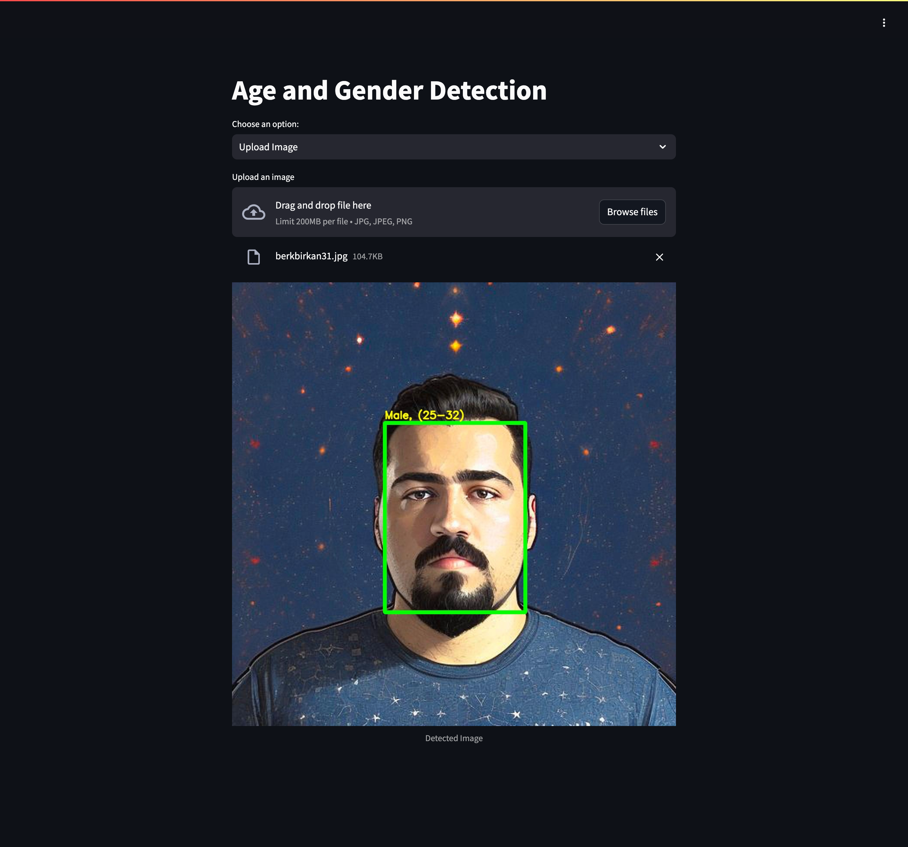
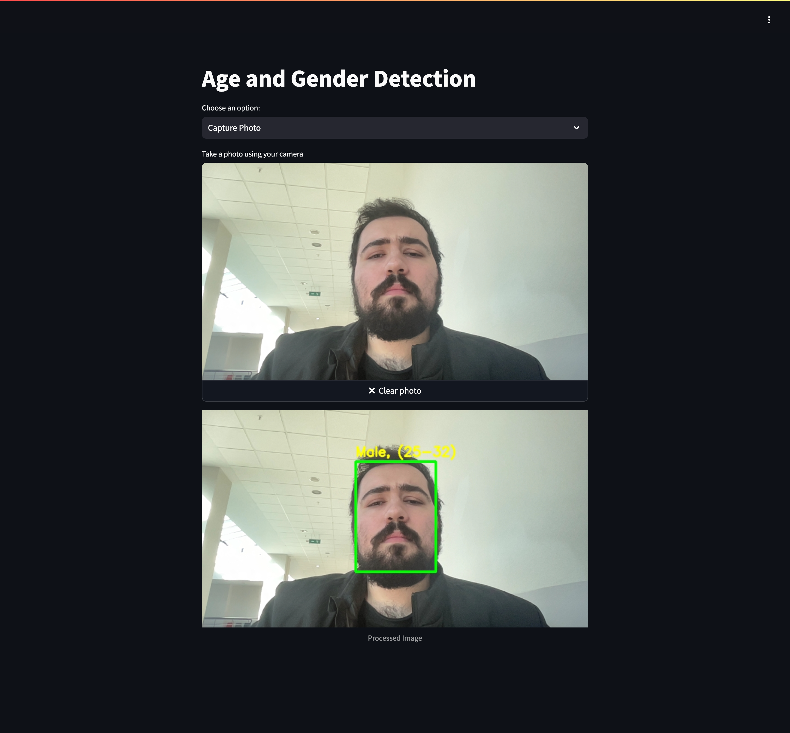

# Age and Gender Detection with Streamlit and OpenCV

This project provides real-time **age and gender detection** using **OpenCV** and **Streamlit**. It supports:
- **Image upload**: Process uploaded images.
- **Photo capture**: Capture photos using your browser's camera.
- **Live camera**: Stream video from your camera for real-time detection.

The project is **containerized using Docker**, making it easy to deploy and run.

---

## 🚀 Features

1. **Real-time Age and Gender Detection**
   - Uses deep learning models for accurate age and gender prediction.
2. **User-Friendly Interface**
   - Built with Streamlit for a simple web-based UI.
3. **Live Camera Support**
   - Access your browser's camera for real-time video streaming.
4. **Containerized Deployment**
   - Easy setup using Docker and Docker Compose.

---

## 🖥️ Screenshots

### Image Upload
Users can upload an image for age and gender detection.



---

### Capture Photo
Users can take a snapshot using their device's camera.



---

## 🛠️ Installation and Setup

### Prerequisites
Before running the project, ensure you have the following installed:
- **Docker** (19.03 or later)
- **Docker Compose** (1.25 or later)
- **Python** (3.9 or later, optional for local setup)

---

### 1. Clone the Repository

```bash
git clone https://github.com/yourusername/age-gender-detection.git
cd age-gender-detection
